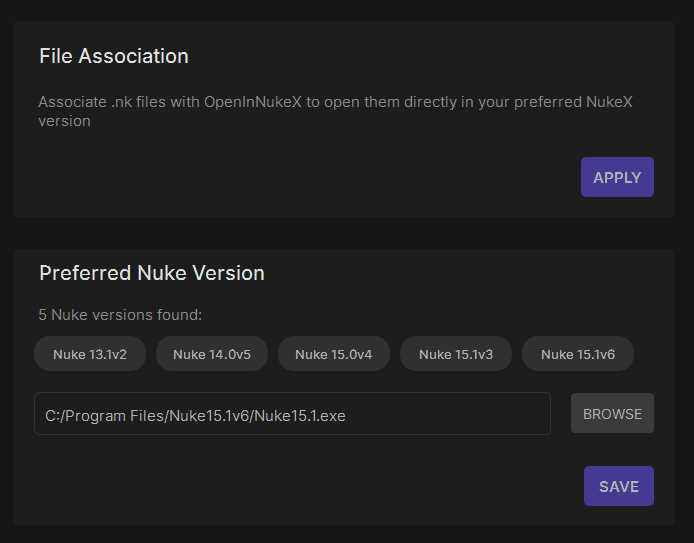

# OpenInNukeX v1.52

Lega | v2025


OpenInNukeX es una aplicación de dos partes diseñada para abrir archivos .nk directamente en NukeX desde el explorador de archivos de Windows. Una parte es un servidor (python) que se instala en nuke, y la otra es un cliente (Qt y C++) que se conecta a este servidor para enviarle la orden de abrir un archivo.

Está diseñada para funcionar exclusivamente con versiones de NukeX, no con otras variantes de Nuke (por ejemplo, Nuke, Nuke Non-commercial, etc) y solo corre en Windows.


## Instalación

- Copiar la carpeta OpenInNukeX que contiene un .py a %USERPROFILE%/.nuke.
- Con un editor de texto, agregar esta línea de código al archivo init.py que está dentro de la carpeta .nuke:
```python
nuke.pluginAddPath('./LGA_OpenInNukeX')
```


- Ejecutar LGA_OpenInNukeX_Setup.exe. Al terminar la instalación, abrir la aplicación para entrar a la configuración:


- El botón apply asocia a los archivos .nk con OpenInNukeX. Esto permite que al abrir cualquier .nk desde el explorer, sea OpenInNukeX quien gestione como se abren los archivos. Se usa una herramienta externa para esto: SetUserFTA
- Si hay alguna ventana de Nuke abierta, se abrirán siempre en la ventana abierta. Si no hay una ventana de Nuke abierta, se usará la versión de Nuke seleccionada en el menú de abajo (en NukeX).
